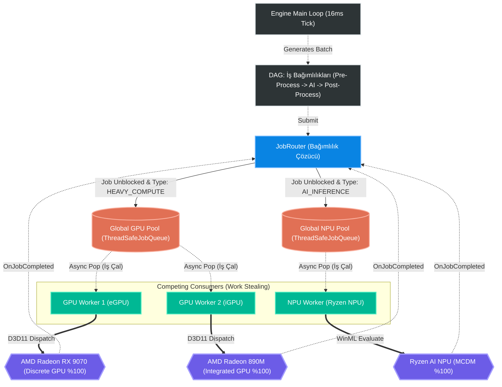

# HybridCore: Mimari ve Akış Diyagramı (Work Stealing)

Aşağıdaki **Mermaid.js** tabanlı diyagram, motorun C++ seviyesindeki çalışma mantığını, bağımlılık (DAG) yönetim sistemini ve özel donanım işçilerinin (Worker Pool) merkezi havuzdan nasıl kilitlenmeden (lock-free) asenkron iş çaldıklarını göstermektedir.

## Karar Mekanizmaları ve İş Akışı
1. **Engine Tick (Motor Döngüsü):** `Engine::Update()` sistemi sürekli izler. Sistemin nefes alabileceği yer varsa, donanımlara (J1, J2, J3) zincirinden oluşan yeni bir iş bloğu (Batch) paketler ve *JobRouter*'a iletir.
2. **DAG Çözümü (Bağımlılık Zinciri):** `JobRouter` gelen işlerin `dependencies` (bağımlılık) listesini kontrol eder. Örneğin `J2 (AI)`, `J1 (eGPU)` bitmeden devreye alınmaz. `J1` bitince `J2` tetiklenir.
3. **Kuyruk Yönlendirmesi (Entegre Havuzlar):** Bağımlılığı çözülen işler, türlerine göre iki devasa havuza kilitlenebilir kuyruk (ThreadSafeJobQueue) kullanılarak bırakılır: biri **GPU**'lar için (HEAVY_COMPUTE), diğeri **NPU**'lar için (AI_INFERENCE).
4. **İş Çalma (Work Stealing Mimarisi):** Burada sistem adaleti bir kenara bırakır ve acımasız davranır! GPU Worker'lar her kendi işleri biter bitmez `Global GPU Pool`'dan anlık olarak (`cv.wait` üzerinden async lock kırarak) radikal bir hızda yeni bir İş Çalarlar. RX 9070 bu yarışta 890M'e göre aşırı süratli olduğu için iş yükünün tamamına yakınını organik olarak sırtlar ve %100 orana vurur.
5. **Geri Bildirim Döngüsü:** Donanımların işlemleri bittiğinde, `OnJobCompleted` olayı (Event) Router'a fırlatılır. `JobRouter` bunu merkeze alır ve bağlı olduğu bir iş varsa (Örneğin J3, J2 bitince uyanacaktır) onu Global havuza serbest bırakır ve sistem döngüsü devam eder.
