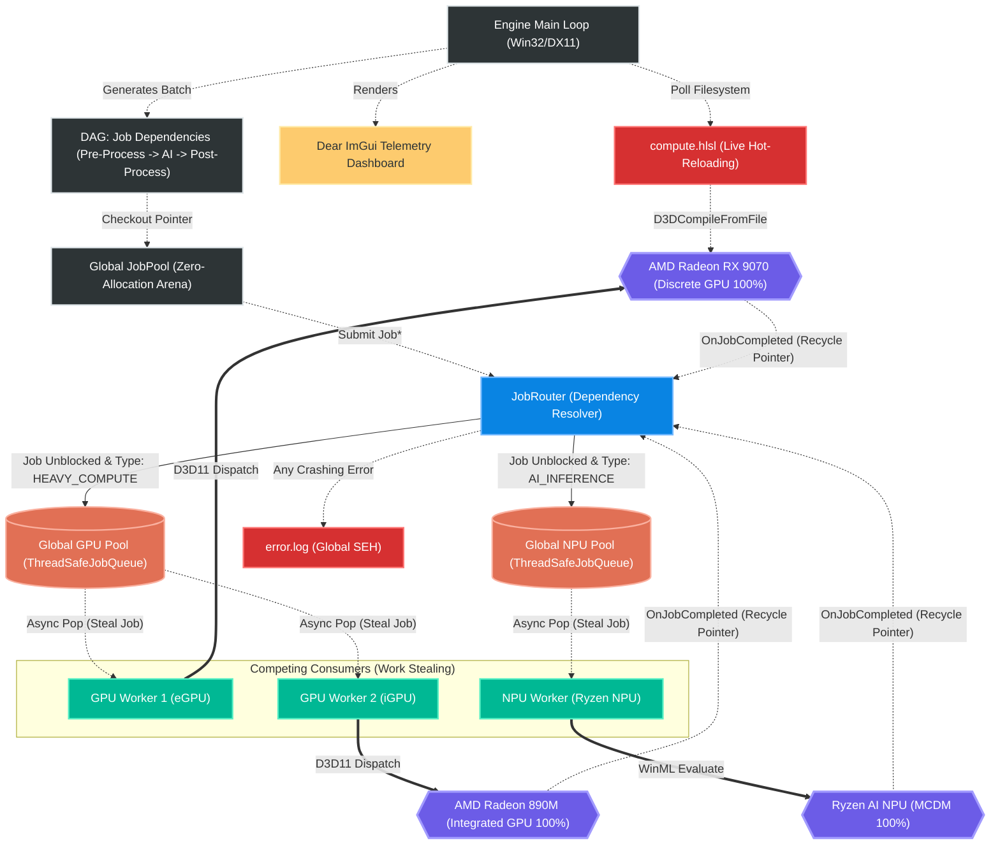

# HybridCore: Architecture and Flow Diagram (Industrial Grade)

The **Mermaid.js** based diagram below illustrates the internal architecture at the C++ level, highlighting the Directed Acyclic Graph (DAG) dependency management, the Zero-Allocation Arena, and how dedicated hardware worker pools asynchronously "steal" jobs lock-free while communicating with a Live ImGui Telemetry layer.

## Decision Mechanisms and Workflow
1. **Engine Tick:** `Engine::Update()` continuously monitors the system. Whenever the system has capacity to breathe, it allocates raw pointers from the static `JobPool` array guaranteeing absolutely zero heap fragmentation (GC pauses) during intensive workloads.
2. **DAG Resolution (Dependency Chain):** The `JobRouter` evaluates the `dependencies` list of incoming jobs. For instance, `J2 (AI)` is never scheduled until `J1 (eGPU)` completes. Once `J1` finishes, `J2` is unblocked.
3. **Queue Routing (Integrated Pools):** Unblocked jobs are dispatched into one of two massive, lockable pools (`ThreadSafeJobQueue`) based on their computation type: one for **GPUs** (`HEAVY_COMPUTE`) and another for **NPUs** (`AI_INFERENCE`).
4. **Work Stealing Architecture:** At this stage, the system abandons "fairness" and becomes completely aggressive! As soon as a GPU Worker finishes its active task, it instantaneously queries the `Global GPU Pool` and steals a new job with extreme speed.
5. **Dynamic Shader Reloading:** During hardware iteration, `compute.hlsl` modification times are actively measured by the system. Any IDE save physically invokes a background D3D Compiler replacing the GPU kernel entirely without rebooting the C++ environment.
6. **Hardware Feedback Loop & Telemetry:** Upon hardware execution completion, an `OnJobCompleted` event is fired back to the Router. Simultaneously, the `Dear ImGui` framework processes the Router's global statistics rendering identical real-time distributions directly above the original desktop window. If any catastrophic failures occur, `SetUnhandledExceptionFilter` catches the unmanaged faults logging immutable details to `error.log`.
